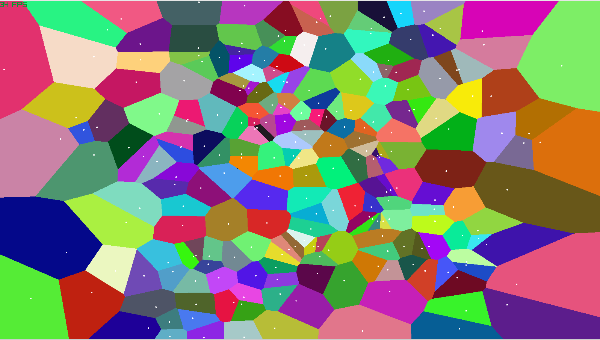

# Voronoi Diagram Renderer

This project implements an interactive, real-time Voronoi diagram visualizer using [Raylib](https://www.raylib.com/) and C#. It supports dynamic seed generation, user interaction.

## Features

* 🌈 **Colorful Voronoi Cells** rendered on CPU
* ⚡ **Fast Voronoi Cell Clipping Algorithm**
* 🖱️ **Interactive Interface**: Click to add points (seeds)
* 🎛️ **Real-Time Controls**: Regenerate seeds
* 🎥 **Resizable window** with dynamic updates

## Screenshots



## Controls

### Global

| Key               | Action                                       |
| ----------------- | -------------------------------------------- |
| `R`               | Restart seeds                                |
| Mouse Left Click  | Add a new seed                               |

## Requirements

* [.NET 6 or later](https://dotnet.microsoft.com/)
* [Raylib-cs](https://github.com/ChrisDill/Raylib-cs) bindings for C#

## Running

```bash
dotnet build
dotnet run
```

## Project Structure

* **Program.cs**: Main application logic
* **Voronoi Algorithm**: Implemented in `RenderVoronoiFast()` using polygon clipping with bisectors
* **Seeds**: Represented with position, velocity, and color

## Notes

* Uses a fixed number of seeds (default: 110) generated either randomly or in spiral patterns.
* `CheckLineIntersectPoly` and `GetVoronoiCellFast` form the core of the clipping algorithm.
